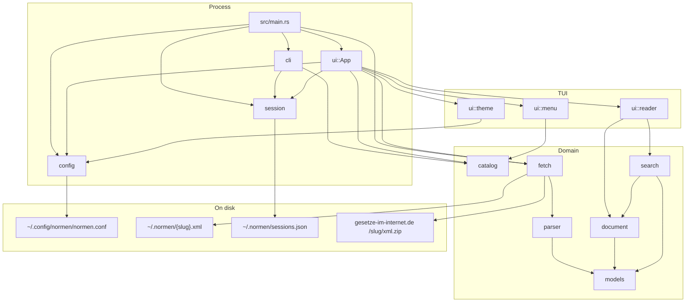
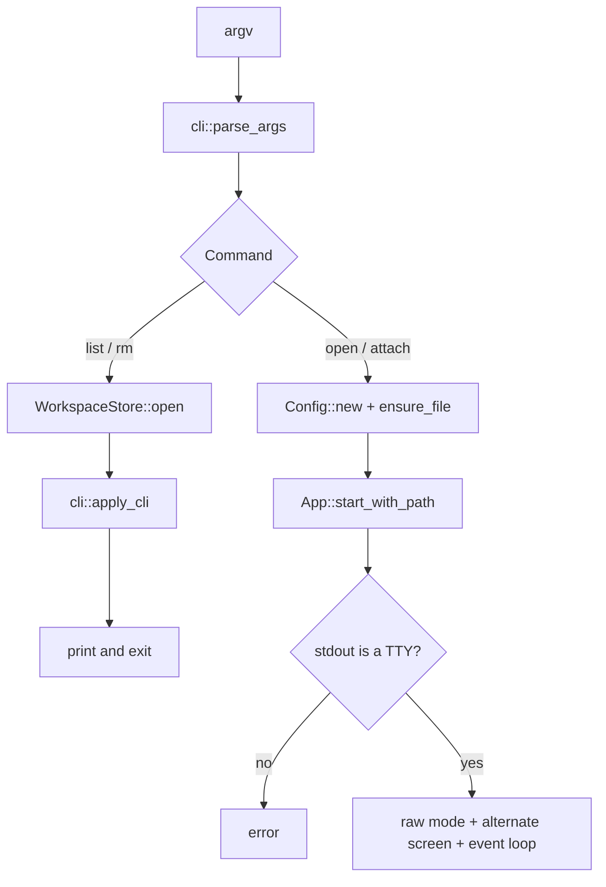
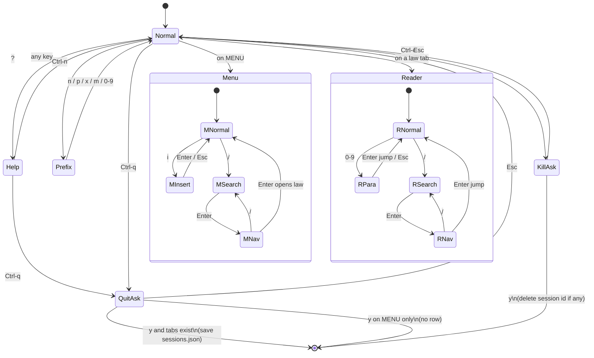
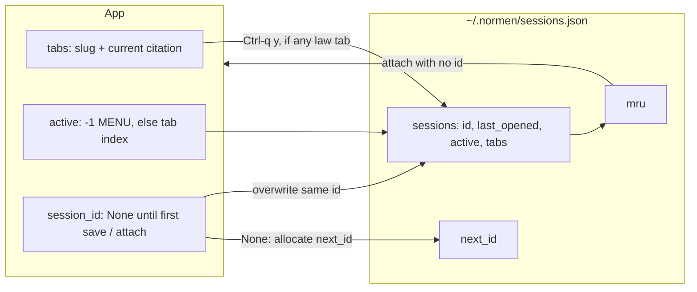

# Architecture

normen is a single Rust binary. `main` parses the CLI, then either prints
workspace rows or runs a Ratatui loop. Laws are not bundled: the catalog is a
static list of shortcuts and gesetze-im-internet.de slugs. Opening a law
downloads `xml.zip`, caches the XML under `~/.normen`, and parses it into
in-memory `Law` / `Norm` values. Workspaces are written only on explicit save.

## Layers



`src/lib.rs` exports every module. The binary is a thin dispatcher. Tests live
next to the code (`#[cfg(test)]` in each module). UI tests drive `App` with a
fake loader and a Ratatui `TestBackend`.

## Startup



Bare `normen` is `Command::Open` with no law: a new unsaved workspace on MENU.
`normen BGB 433` is the same command with an initial law and citation.
`attach` / `attach <id>` restore tabs from `sessions.json`. `list` and `rm`
never enter the TUI.

`--refresh` is a flag on every path that can open a law. It forces
`fetch::load_law` to download again.

## Open a law

```mermaid
sequenceDiagram
    participant User
    participant App
    participant Catalog
    participant Fetch
    participant GII as gesetze-im-internet.de
    participant Disk as ~/.normen
    participant Parser
    participant Tab as ReaderTab

    User->>App: Enter / shortcut / CLI law
    App->>Catalog: resolve_law(query)
    Catalog-->>App: LawRef shortcut + slug
    App->>Fetch: load(LawRef, refresh)
    alt cache miss or --refresh
        Fetch->>GII: GET /{slug}/xml.zip
        GII-->>Fetch: zip bytes
        Fetch->>Disk: write {slug}.xml
    else cache hit
        Fetch->>Disk: read {slug}.xml
    end
    Fetch->>Parser: try_parse_law_xml
    Parser-->>App: Law
    App->>Tab: ReaderTab::from_law + apply_initial
    Note over App,Tab: always a new tab; same slug may be open twice
```

`LawRef` is compile-time data (`shortcut`, `slug`, `title`, `aliases`). The
slug must match the GII folder name exactly (`bgb`, `btgo_2025`, `bbaug`).
`resolve_law` matches shortcut, slug, or alias, case-insensitive.
`filter_laws` is substring search for the MENU `/` list.

The parser walks GII `<norm>` nodes, skips the table of contents, and builds
`CitationKey` values from `enbez` (`§ 433`, `Art 1`, ranges). `document`
formats headings and splits body text into prose and numbered list blocks for
the reader cards.

## App state

`App` owns the keymap, a `load` closure, MENU state, a `Vec<ReaderTab>`, and
the workspace store. `active == -1` means MENU. Opening a law always appends a
tab. Each tab keeps its own scroll position, PARA buffer, and search hits.



Key dispatch in `handle_key` is a stack, not a generic router: Ctrl-c, then
kill overlay, then quit overlay, then help, then `Ctrl-q`, then the tab
prefix, then MENU or reader. Overlays swallow every other key. Theme tokens
are read once at draw time from `Theme::from_config`; there is no reload key.

Reader motion (`j`/`k` line, `J`/`K` paragraph, `h`/`l` norm) works on a
window of norms around `current` (`WINDOW_RADIUS`). Search highlight uses a
semantic `search-hit` marker; `span_style` maps it to `theme.accent` /
`theme.search_fg`.

## Persistence



Last write wins. Ids are never reused. MENU-only quit writes nothing.
`Ctrl-c` then `y` quits without saving and deletes the attached id if there
is one. `normen` never auto-resumes; attach is always explicit.

## Config

`~/.config/normen/normen.conf` is rust-ini. First run writes `DEFAULT_TEXT`
and never patches an existing file. `[keys]`, `[reader]`, and `[tabs]` remap
actions. Commented `[theme]` documents the ten `#rrggbb` tokens. Quoted
values keep a leading `#` so colors are not treated as comments. Invalid or
omitted tokens keep the compiled pastel-dark defaults.
